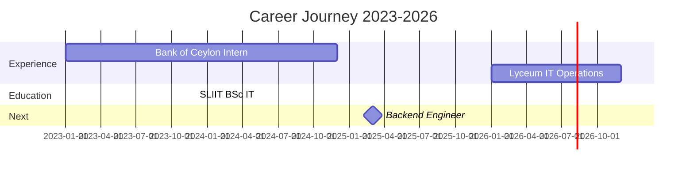

---

## 🔥 **This Week I Spent My Time On:**

**🔥 Updates automatically every week via GitHub Actions!** [web:24]

---

## 🚀 **Backend Software Engineer**

**BSc (Hons) IT** | SLIIT | **Open to Junior Software Engineer roles**

**Core Expertise:**
- 🖥️ **Backend**: Java, Spring Boot, Python, REST APIs
- 🌐 **Full-Stack**: React, React Native, Node.js
- 🗄️ **Databases**: PostgreSQL, MySQL, SQL
- ☁️ **DevOps**: Docker, AWS, GitHub Actions, Linux

---

## 💼 **Professional Experience**

### **Software Developer Intern**  
**Bank of Ceylon** | 2023-2024
- Built internal banking apps with **React Native**
- Backend systems & **database integration**
- **UAT** & full **SDLC** participation
- Production-level system exposure

### **IT Operations Specialist**  
**Lyceum International School** | 2026-Present
- 100+ workstation infrastructure management
- **Active Directory** & user administration
- **99.9% uptime** through proactive troubleshooting
- System deployments & operational continuity

---

## 🛠️ **Tech Stack**

<table>
<tr>
<td width="33%">

</td>
<td width="33%">

</td>
<td width="33%">

</td>
</tr>
</table>

---

## 📊 **GitHub Analytics**

---

## 🏆 **Certifications**

 

---

## 🔥 **Featured Projects**

| Project | Stack | Impact |
|---------|-------|--------|
| Core Banking System | Java, Spring Boot, PostgreSQL | Enterprise APIs |
| Lab Management | React, Python, MySQL | Full-stack ops |
| Banking Mobile | React Native, APIs | Production UAT |

---

## 🌐 **Connect**

**📩 Junior Software Engineer opportunities welcome!**  
Backend • Full-Stack • Cloud Engineering

